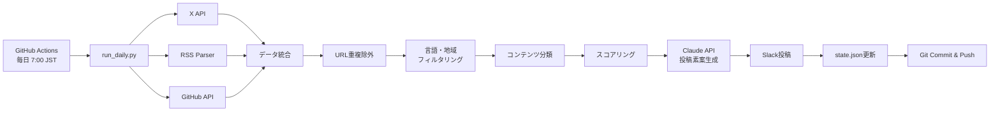
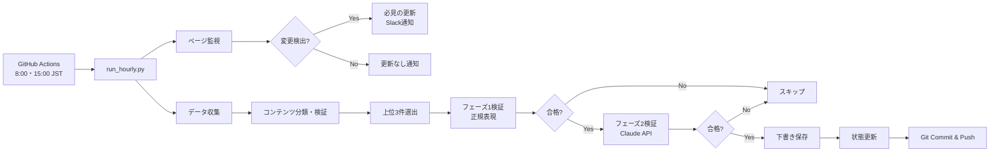

# AIデイリーレポート自動生成基盤

AI関連情報を毎日自動で収集・整理し、Slackに読みやすいレポートとして投稿するシステムです。

## 特徴

### デイリーレポート（毎日7:00 JST）

- **X公式API Basic ($200/月) に最適化**
  - 新着のみ取得 (`since_id` 利用)
  - 1日あたり150投稿の上限管理
  - 無駄なAPI消費を防止
  - URL重複チェックで同一記事の複数検出を防止

- **多様な情報ソース**
  - X (Twitter): アカウント監視 + キーワード検索
  - RSS: AI企業公式ブログ
  - GitHub: リポジトリのリリース情報

- **AI生成の高品質X投稿素案**
  - Claude API による構造化要約生成
  - キャッチコピー + 章立て箇条書き形式
  - ビジネスパーソン・エンジニア向けに最適化
  - そのままコピペして投稿可能

- **自動運用**
  - GitHub Actionsで毎日実行
  - 状態管理で新着のみ取得
  - Slackへ自動投稿

### セミデイリーレポート（8:00・15:00 JST）

- **必見ページの変更監視**
  - Cursor Changelog、Cursor Blog
  - Claude Code Documentation
  - Anthropic Research
  - GitHub Copilot Blog

- **自動下書き生成**
  - 上位3件の投稿案を自動生成
  - 2段階の品質検証（正規表現 + Claude APIレビュー）
  - 承認待ち下書きとして保存
  - 手動投稿ワークフローに対応

- **変更検出の仕組み**
  - HTMLハッシュ値で変更検出
  - 前回スナップショットとの差分比較
  - 変更時にSlack通知

## セットアップ

### 1. リポジトリ作成

GitHubで新規リポジトリを作成し、本プロジェクトをプッシュします。

```bash
git init
git add .
git commit -m "Initial commit"
git remote add origin https://github.com/YOUR_USERNAME/YOUR_REPO.git
git push -u origin main
```

### 2. Secrets設定

GitHubリポジトリの Settings > Secrets and variables > Actions で以下を設定:

#### デイリーレポート用（必須）

| Secret名 | 説明 |
|---------|------|
| `X_BEARER_TOKEN` | X API Bearer Token (Basic $200/月プラン) |
| `SLACK_WEBHOOK_URL` | Slack Incoming Webhook URL |
| `ANTHROPIC_API_KEY` | Claude API キー (X投稿素案生成用) |
| `GITHUB_TOKEN` | (自動設定済み) GitHub API用トークン |

#### セミデイリーレポート用（オプション - 投稿機能を使う場合）

| Secret名 | 説明 |
|---------|------|
| `X_API_KEY` | X API Consumer Key (OAuth 1.0a 認証用) |
| `X_API_SECRET` | X API Consumer Secret |
| `X_ACCESS_TOKEN` | X API Access Token |
| `X_ACCESS_TOKEN_SECRET` | X API Access Token Secret |

セミデイリーレポートの下書き機能のみ使う場合、OAuth認証情報は不要です。

#### X API Bearer Tokenの取得方法

1. [X Developer Portal](https://developer.twitter.com/) にアクセス
2. プロジェクトを作成し、Basic ($200/月) プランに加入
3. Bearer Tokenを生成してコピー

#### Slack Webhook URLの取得方法

1. Slack Workspace で Apps > Incoming Webhooks を検索
2. 投稿先チャンネルを選択
3. Webhook URLをコピー

#### Claude API キーの取得方法

1. [Anthropic Console](https://console.anthropic.com/) にアクセス
2. API Keys から新しいキーを作成
3. キーをコピー（Claude Code Max プランをご利用の場合、そのAPIキーを使用可能）

### 3. 設定カスタマイズ

[config.yaml](config.yaml) を編集:

```yaml
# 監視対象アカウントを追加
x:
  accounts:
    - your_account_name

# キーワードを追加
x:
  keywords:
    - "Your Keyword"

# RSSフィードを追加
rss:
  feeds:
    - url: "https://example.com/feed.xml"
      name: "Example Blog"

# GitHubリポジトリを追加
github:
  repositories:
    - "owner/repo"
```

### 4. 初回実行

GitHub Actions タブで `AI Daily Report` ワークフローを手動実行:

1. Actions タブを開く
2. `AI Daily Report` を選択
3. `Run workflow` > `Run workflow` をクリック

### 5. 自動実行確認

翌日の朝7:00（JST）に自動実行されることを確認します。

## ファイル構成

```
.
├── .github/
│   └── workflows/
│       ├── ai-daily.yml           # デイリーレポート（毎日7:00 JST）
│       └── ai-semi-daily.yml      # セミデイリーレポート（8:00・15:00 JST）
├── config.yaml                    # 設定ファイル（アカウント・キーワード等）
├── data/
│   ├── state.json                 # デイリーレポート用状態管理
│   ├── state_hourly.json          # セミデイリーレポート用状態管理
│   ├── drafts.json                # 下書き保存
│   └── snapshots/                 # ページスナップショット（HTML変更検出用）
├── scripts/
│   ├── run_daily.py               # デイリーレポート メインスクリプト
│   ├── run_hourly.py              # セミデイリーレポート メインスクリプト
│   ├── content_classifier.py      # コンテンツ分類・スコアリング
│   ├── content_validator.py       # コンテンツ検証（メタメッセージ検出・Claude APIレビュー）
│   ├── draft_manager.py           # 下書き管理
│   └── post_drafts.py             # 手動投稿スクリプト
├── requirements.txt               # Python依存パッケージ
└── README.md                      # このファイル
```

## システム構成

### デイリーレポート（毎日7:00 JST）



### セミデイリーレポート（8:00・15:00 JST）



### 処理フロー

#### デイリーレポート

1. **データ収集** (run_daily.py)
   - X API: アカウント監視 (100件/日) + キーワード検索 (50件/日)
   - RSS: 公式ブログの新着記事
   - GitHub: リポジトリの新着リリース

2. **正規化・重複排除**
   - URL単位で重複チェック
   - 同一記事が複数ソースから検出された場合は1件のみ採用

3. **コンテンツフィルタリング** (content_classifier.py)
   - 言語チェック: langdetectで英語のみ収集
   - 地域チェック: 日本ドメイン（.jp, qiita.com, zenn.dev等）を除外
   - カテゴリ分類: PRACTICAL（実用的）、TECHNICAL（技術詳細）、GENERAL（一般）等
   - 除外判定: MARKETING（マーケティング）、EXCLUDED（実験的）、PERSONAL_USAGE（個人利用）

4. **スコアリング**
   - エンゲージメント: いいね×1 + RT×3 + リプライ×2
   - カテゴリボーナス: PRACTICAL_OFFICIAL +700、PRACTICAL +400、TECHNICAL +300
   - カテゴリペナルティ: MARKETING -300、EXCLUDED -800、NON_ENGLISH -900
   - ソース別重み付け: GitHub 1.2x、RSS 1.0x、X 0.8-0.9x

5. **AI要約生成**
   - Claude API (Sonnet 4.5) で投稿素案を生成
   - キャッチコピー + 章立て箇条書き形式
   - API失敗時は簡易要約にフォールバック

6. **Slack投稿**
   - Top Highlights (上位3件)
   - 公式発表 (上位5件)
   - GitHub Updates (上位5件)
   - X Signals (上位10件)
   - X投稿素案 (RSS 3件 + GitHub 2件 + Top 2件)

7. **状態保存**
   - state.json に since_id, 最終取得日時を保存
   - Git commit & push で永続化

#### セミデイリーレポート

1. **ページ監視** (run_hourly.py)
   - 監視対象: Cursor Changelog/Blog、Claude Code Docs、Anthropic Research、GitHub Copilot Blog
   - HTMLハッシュ値で変更検出
   - 前回スナップショット（data/snapshots/）との差分比較

2. **必見の更新通知**
   - Cursor Changelog・Blogの変更は必ずSlack通知
   - 変更なしの場合も通知

3. **データ収集・分類**
   - デイリーレポートと同様の収集プロセス
   - 24時間以内の投稿済みURLはスキップ

4. **上位3件の投稿案生成**
   - Claude APIで投稿素案を生成

5. **2段階検証** (content_validator.py)
   - **フェーズ1: 正規表現ベース**
     - メタメッセージ検出（「生成できません」「情報が不足」等）
     - 訴訟フィルタ（「訴訟」「lawsuit」等）
     - 政治コンテンツフィルタ（「大統領令」「政権」等）
     - 最小文字数チェック（50文字以上）
   - **フェーズ2: Claude APIレビュー**
     - 記事タイトルとの整合性チェック
     - 固有名詞の正確性検証（記事にない製品名・機能名を使っていないか）
     - 推測情報の排除

6. **下書き保存**
   - 検証を通過した投稿案を drafts.json に保存
   - ステータス: pending（承認待ち）

7. **スキップサマリー**
   - 検証に失敗した投稿案の理由別サマリーをSlack通知

8. **状態保存**
   - state_hourly.json, drafts.json, data/snapshots/ を更新
   - Git commit & push で永続化

## Slackレポート構成

以下のセクションで構成されます:

1. **Top Highlights** (上位3件)
   - スコアが最も高い情報
2. **Provider Official / RSS** (上位5件)
   - AI企業公式ブログの更新
3. **GitHub Updates** (上位5件)
   - リポジトリのリリース情報
4. **X (Twitter) Signals** (上位10件)
   - アカウント監視・キーワード検索結果
5. **X投稿素案** (最大7件)
   - Claude API で生成された構造化要約
   - RSS 3件 + GitHub 2件 + Top Items 2件
   - キャッチコピー + 章立て箇条書き形式
6. **Stats**
   - 取得数、重複除外数、上限到達の有無

## 下書き管理と手動投稿

セミデイリーレポートで生成された投稿案は、自動的に `data/drafts.json` に下書きとして保存されます。

### 下書きの確認

`data/drafts.json` をGitHubリポジトリで確認するか、ローカルで確認してください。

```json
{
  "drafts": [
    {
      "id": "uuid-string",
      "created_at": "2026-01-25T00:00:00Z",
      "item": { ... },
      "post_text": "投稿案のテキスト",
      "status": "pending",
      "posted_at": null
    }
  ]
}
```

### 手動投稿の方法

#### 全ての承認待ち下書きを投稿

```bash
python scripts/post_drafts.py
```

#### 特定の下書きのみ投稿

```bash
python scripts/post_drafts.py <draft_id>
```

### 投稿に必要な環境変数

手動投稿を行う場合、以下の環境変数が必要です（OAuth 1.0a認証）:

- `X_API_KEY`
- `X_API_SECRET`
- `X_ACCESS_TOKEN`
- `X_ACCESS_TOKEN_SECRET`

これらは GitHub Secrets に設定されていれば、GitHub Actions経由でも投稿可能です。

### 投稿後のステータス

投稿が成功すると、下書きのステータスが `pending` から `posted` に変更されます。

```json
{
  "status": "posted",
  "posted_at": "2026-01-25T01:00:00Z"
}
```

## コンテンツ品質管理

本システムは、高品質な投稿案のみを生成するため、多層的なフィルタリング・検証を実施しています。

### 言語・地域フィルタリング

#### 言語フィルタリング
- **対象**: 英語コンテンツのみ収集
- **ライブラリ**: langdetect
- **チェック対象**: タイトル + 本文
- **判定基準**: 言語検出の信頼度 > 0.7

#### 地域フィルタリング
- **除外対象**: 日本の記事の英語版
- **除外ドメイン**: .jp、qiita.com、zenn.dev、note.com
- **除外URLパターン**: /ja/、/jp/

### コンテンツ分類（content_classifier.py）

記事を9つのカテゴリに自動分類し、スコアボーナス/ペナルティを付与します。

| カテゴリ | スコアボーナス | 説明 | キーワード例 |
|---------|---------------|------|-------------|
| **PRACTICAL_OFFICIAL** | +700 | 公式発表の実用的情報 | release, API, implementation（RSS/GitHub由来） |
| **PRACTICAL** | +400 | 実用的情報 | release, API, how to, use case |
| **TECHNICAL** | +300 | 技術詳細 | deep dive, benchmark, analysis |
| **GENERAL** | 0 | 一般発表 | industry impact, workflow |
| **MARKETING** | -300 | マーケティング的内容 | 革新的、breakthrough、game-changing |
| **PERSONAL_USAGE** | -500 | 個人利用報告 | 使ってみた、I tried、my setup |
| **LOW_CREDIBILITY** | -600 | 信頼性の低いソース | Congrats、heard that、rumor |
| **JAPAN_ORIGIN** | -700 | 日本の記事の英語版 | .jp ドメイン、qiita.com |
| **EXCLUDED** | -800 | 実験的プロジェクト | experimental、PoC、side project |
| **NON_ENGLISH** | -900 | 非英語コンテンツ | 言語検出で日本語等を検出 |

### コンテンツ検証（content_validator.py）

生成された投稿案を2段階で検証し、不適切なコンテンツを除外します。

#### フェーズ1: 正規表現ベース（軽量・高速）

| 検証項目 | 検出パターン例 |
|---------|--------------|
| **メタメッセージ検出** | 「生成できません」「情報が不足」「申し訳ありませんが」 |
| **訴訟フィルタ** | 「訴訟」「提訴」「lawsuit」「sued」 |
| **政治コンテンツフィルタ** | 「大統領令」「政権」「政治的」「administration criticism」 |
| **最小文字数チェック** | 50文字未満は除外 |

#### フェーズ2: Claude APIレビュー（高精度）

Claude API（claude-sonnet-4-5-20250929）で以下をチェック:

1. **固有名詞の正確性**
   - 記事タイトルに含まれない製品名・機能名を使っていないか
   - 例: 記事が "Claude Code v2.1.16" なのに、投稿案で "Claude Engineer Mode" と記載

2. **推測情報の排除**
   - 記事タイトルから推測できない情報を追加していないか
   - 旧称や別名を勝手に補完していないか

3. **記事内容との整合性**
   - 投稿案が記事の情報のみで構成されているか

### スキップされた投稿案のレポート

セミデイリーレポートでは、検証に失敗した投稿案の理由別サマリーがSlackに通知されます。

- メタメッセージ検出: X件
- 訴訟関連コンテンツ: X件
- 政治的コンテンツ: X件
- Claude レビュー失敗: X件

これにより、フィルタリングの効果を可視化し、設定の調整に活用できます。

## 上限管理

X API Basic ($200/月) に収まるよう、以下の上限を設定:

- **アカウント監視**: 100投稿/日
- **キーワード検索**: 50投稿/日
- **合計**: 150投稿/日

上限に到達した場合、Slackレポートに警告が表示されます。

### Claude API 利用量

X投稿素案生成で Claude API (Sonnet 4.5) を使用します:

- **投稿素案生成**: 最大7件/日
- **1リクエストあたり**: 入力 ~500トークン、出力 ~500トークン
- **月間推定**: 約210リクエスト、42万トークン

Claude Code Max プランをご利用の場合、プランに含まれるAPI利用枠を使用できます。

## 実行スケジュール

### デイリーレポート
- **実行時刻**: 毎日7:00（JST）
- **ワークフロー**: [.github/workflows/ai-daily.yml](.github/workflows/ai-daily.yml)
- **処理内容**: X・RSS・GitHubからデータ収集 → Slackレポート投稿

### セミデイリーレポート
- **実行時刻**: 毎日8:00・15:00（JST）
- **ワークフロー**: [.github/workflows/ai-semi-daily.yml](.github/workflows/ai-semi-daily.yml)
- **処理内容**: ページ監視（必見の更新） → 上位3件の投稿案を下書き保存

## トラブルシューティング

### ワークフローが失敗する

1. Secrets が正しく設定されているか確認
2. Actions タブで詳細ログを確認
3. `state.json` が破損していないか確認

### X APIエラー

- Bearer Tokenが有効か確認
- Basicプランの課金状態を確認
- レート制限に達していないか確認

### Slack投稿されない

- Webhook URLが有効か確認
- チャンネルが存在するか確認

### X投稿素案が簡易要約になる

- `ANTHROPIC_API_KEY` が正しく設定されているか確認
- Claude API のレート制限に達していないか確認
- ワークフローログで API エラーメッセージを確認

## カスタマイズ

### 実行時刻を変更

[.github/workflows/ai-daily.yml](.github/workflows/ai-daily.yml) の `cron` を編集:

```yaml
schedule:
  - cron: '0 20 * * *'  # UTC時刻で指定（JST-9時間）
```

### 取得上限を変更

[config.yaml](config.yaml) の `limits` を編集:

```yaml
x:
  limits:
    accounts: 100
    search: 50
    total: 150
```

### スコアリングロジックを変更

[config.yaml](config.yaml) の `scoring` を編集:

```yaml
slack:
  scoring:
    like_weight: 1
    retweet_weight: 3
    reply_weight: 2
```

### セミデイリーレポートの監視ページを変更

[config.yaml](config.yaml) の `page_monitoring.pages` を編集:

```yaml
page_monitoring:
  enabled: true
  pages:
    - url: "https://example.com/changelog"
      name: "Example Changelog"
      must_include: true  # 必見の更新に含める場合
```

### コンテンツフィルタリングを調整

[config.yaml](config.yaml) の `content_filtering` を編集:

```yaml
content_filtering:
  # 言語フィルタリング
  language_filtering:
    enabled: true
    target_language: "en"  # 英語のみ

  # 地域フィルタリング
  region_filtering:
    enabled: true
    excluded_domains:
      - ".jp"
      - "qiita.com"

  # カテゴリボーナス
  category_bonuses:
    PRACTICAL: 400
    TECHNICAL: 300
    MARKETING: -300
```

### コンテンツ検証を調整

[config.yaml](config.yaml) の `content_validation` を編集:

```yaml
content_validation:
  enabled: true

  # Claude APIレビュー
  claude_review:
    enabled: true
    max_reviews_per_run: 10  # コスト管理
```

## 今後の拡張案

- [x] Claude API による高品質X投稿素案生成
- [x] URL重複チェックで同一記事の複数検出を防止
- [ ] 記事本文取得の改善（RSS description、HTML パース、GitHub Release body）
- [ ] Slackスレッド分割対応
- [ ] LLMによる影響度分類（Breaking / Info等）
- [ ] 複数Slackチャンネル対応
- [ ] Discord / Webhook対応

## ライセンス

MIT License

## 作成者

あなたの名前
