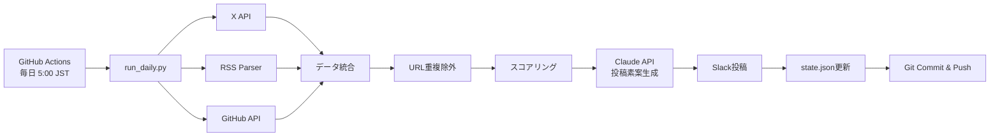

# AIデイリーレポート自動生成基盤

AI関連情報を毎日自動で収集・整理し、Slackに読みやすいレポートとして投稿するシステムです。

## 特徴

- **X公式API Basic ($200/月) に最適化**
  - 新着のみ取得 (`since_id` 利用)
  - 1日あたり150投稿の上限管理
  - 無駄なAPI消費を防止
  - URL重複チェックで同一記事の複数検出を防止

- **多様な情報ソース**
  - X (Twitter): アカウント監視 + キーワード検索
  - RSS: AI企業公式ブログ
  - GitHub: リポジトリのリリース情報

- **AI生成の高品質X投稿素案**
  - Claude API による構造化要約生成
  - キャッチコピー + 章立て箇条書き形式
  - ビジネスパーソン・エンジニア向けに最適化
  - そのままコピペして投稿可能

- **自動運用**
  - GitHub Actionsで毎日実行
  - 状態管理で新着のみ取得
  - Slackへ自動投稿

## セットアップ

### 1. リポジトリ作成

GitHubで新規リポジトリを作成し、本プロジェクトをプッシュします。

```bash
git init
git add .
git commit -m "Initial commit"
git remote add origin https://github.com/YOUR_USERNAME/YOUR_REPO.git
git push -u origin main
```

### 2. Secrets設定

GitHubリポジトリの Settings > Secrets and variables > Actions で以下を設定:

| Secret名 | 説明 |
|---------|------|
| `X_BEARER_TOKEN` | X API Bearer Token (Basic $200/月プラン) |
| `SLACK_WEBHOOK_URL` | Slack Incoming Webhook URL |
| `ANTHROPIC_API_KEY` | Claude API キー (X投稿素案生成用) |
| `GITHUB_TOKEN` | (自動設定済み) GitHub API用トークン |

#### X API Bearer Tokenの取得方法

1. [X Developer Portal](https://developer.twitter.com/) にアクセス
2. プロジェクトを作成し、Basic ($200/月) プランに加入
3. Bearer Tokenを生成してコピー

#### Slack Webhook URLの取得方法

1. Slack Workspace で Apps > Incoming Webhooks を検索
2. 投稿先チャンネルを選択
3. Webhook URLをコピー

#### Claude API キーの取得方法

1. [Anthropic Console](https://console.anthropic.com/) にアクセス
2. API Keys から新しいキーを作成
3. キーをコピー（Claude Code Max プランをご利用の場合、そのAPIキーを使用可能）

### 3. 設定カスタマイズ

[config.yaml](config.yaml) を編集:

```yaml
# 監視対象アカウントを追加
x:
  accounts:
    - your_account_name

# キーワードを追加
x:
  keywords:
    - "Your Keyword"

# RSSフィードを追加
rss:
  feeds:
    - url: "https://example.com/feed.xml"
      name: "Example Blog"

# GitHubリポジトリを追加
github:
  repositories:
    - "owner/repo"
```

### 4. 初回実行

GitHub Actions タブで `AI Daily Report` ワークフローを手動実行:

1. Actions タブを開く
2. `AI Daily Report` を選択
3. `Run workflow` > `Run workflow` をクリック

### 5. 自動実行確認

翌日の朝5:00（JST）に自動実行されることを確認します。

## ファイル構成

```
.
├── .github/
│   └── workflows/
│       └── ai-daily.yml        # GitHub Actionsワークフロー
├── config.yaml                 # 設定ファイル（アカウント・キーワード等）
├── data/
│   └── state.json              # 状態管理（since_id等を保存）
├── scripts/
│   └── run_daily.py            # メインスクリプト
├── requirements.txt            # Python依存パッケージ
└── README.md                   # このファイル
```

## システム構成



### 処理フロー

1. **データ収集** (run_daily.py)
   - X API: アカウント監視 (100件/日) + キーワード検索 (50件/日)
   - RSS: 公式ブログの新着記事
   - GitHub: リポジトリの新着リリース

2. **正規化・重複排除**
   - URL単位で重複チェック
   - 同一記事が複数ソースから検出された場合は1件のみ採用

3. **スコアリング**
   - エンゲージメント: いいね×1 + RT×3 + リプライ×2
   - 公式ソースボーナス: RSS +500, GitHub +300

4. **AI要約生成**
   - Claude API (Sonnet 4.5) で投稿素案を生成
   - キャッチコピー + 章立て箇条書き形式
   - API失敗時は簡易要約にフォールバック

5. **Slack投稿**
   - Top Highlights (上位3件)
   - 公式発表 (上位5件)
   - GitHub Updates (上位5件)
   - X Signals (上位10件)
   - X投稿素案 (RSS 3件 + GitHub 2件 + Top 2件)

6. **状態保存**
   - state.json に since_id, 最終取得日時を保存
   - Git commit & push で永続化

## Slackレポート構成

以下のセクションで構成されます:

1. **Top Highlights** (上位3件)
   - スコアが最も高い情報
2. **Provider Official / RSS** (上位5件)
   - AI企業公式ブログの更新
3. **GitHub Updates** (上位5件)
   - リポジトリのリリース情報
4. **X (Twitter) Signals** (上位10件)
   - アカウント監視・キーワード検索結果
5. **X投稿素案** (最大7件)
   - Claude API で生成された構造化要約
   - RSS 3件 + GitHub 2件 + Top Items 2件
   - キャッチコピー + 章立て箇条書き形式
6. **Stats**
   - 取得数、重複除外数、上限到達の有無

## 上限管理

X API Basic ($200/月) に収まるよう、以下の上限を設定:

- **アカウント監視**: 100投稿/日
- **キーワード検索**: 50投稿/日
- **合計**: 150投稿/日

上限に到達した場合、Slackレポートに警告が表示されます。

### Claude API 利用量

X投稿素案生成で Claude API (Sonnet 4.5) を使用します:

- **投稿素案生成**: 最大7件/日
- **1リクエストあたり**: 入力 ~500トークン、出力 ~500トークン
- **月間推定**: 約210リクエスト、42万トークン

Claude Code Max プランをご利用の場合、プランに含まれるAPI利用枠を使用できます。

## トラブルシューティング

### ワークフローが失敗する

1. Secrets が正しく設定されているか確認
2. Actions タブで詳細ログを確認
3. `state.json` が破損していないか確認

### X APIエラー

- Bearer Tokenが有効か確認
- Basicプランの課金状態を確認
- レート制限に達していないか確認

### Slack投稿されない

- Webhook URLが有効か確認
- チャンネルが存在するか確認

### X投稿素案が簡易要約になる

- `ANTHROPIC_API_KEY` が正しく設定されているか確認
- Claude API のレート制限に達していないか確認
- ワークフローログで API エラーメッセージを確認

## カスタマイズ

### 実行時刻を変更

[.github/workflows/ai-daily.yml](.github/workflows/ai-daily.yml) の `cron` を編集:

```yaml
schedule:
  - cron: '0 20 * * *'  # UTC時刻で指定（JST-9時間）
```

### 取得上限を変更

[config.yaml](config.yaml) の `limits` を編集:

```yaml
x:
  limits:
    accounts: 100
    search: 50
    total: 150
```

### スコアリングロジックを変更

[config.yaml](config.yaml) の `scoring` を編集:

```yaml
slack:
  scoring:
    like_weight: 1
    retweet_weight: 3
    reply_weight: 2
```

## 今後の拡張案

- [x] Claude API による高品質X投稿素案生成
- [x] URL重複チェックで同一記事の複数検出を防止
- [ ] 記事本文取得の改善（RSS description、HTML パース、GitHub Release body）
- [ ] Slackスレッド分割対応
- [ ] LLMによる影響度分類（Breaking / Info等）
- [ ] 複数Slackチャンネル対応
- [ ] Discord / Webhook対応

## ライセンス

MIT License

## 作成者

あなたの名前
